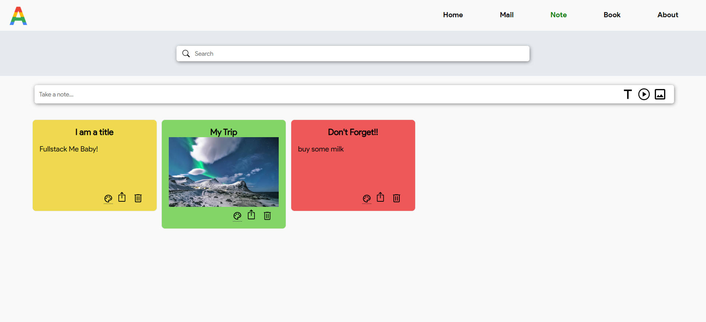

	<h1>Appsus</h1>

A single page responsive application with a set of mini apps (mail, note, book), built over a duration of 4 days. [Check it out here](https://yael273.github.io/Appsus/ "Website link")!

___

### Table of Contents
- [Application Assets](#application-assets)
- [Mail App](#mail-app)
- [Note App](#note-app)
- [Book App](#book-app)

## Application Assets
- Reusable Components (LongTxt, UserMsg...)
- EventBus communication (useful components located at different areas of the DOM).
- QueryString Params- a query string is the part of a uniform resource locator (URL) which assigns values to specified parameters. Query string parameters are a useful way to communicate between routes adding optional parameters.
- Meaningful demo data (including data from Google API)

## Mail App 

An email client app built by [Moria Hamami](https://github.com/MoriaHamami), with a design inspired by Gmail. The user can view his inbox and other folders, view an email, and compose new emails. This app does not work with a real server, so emails are not really sent, but the user experience feels real.

### Features List
- A list of emails display.
- A click on an email opens an email-preview.
- A click on an email-preview opens the email for reading.
- A read/unread state per email.
- An unread emails count display.
- Compose – creating a new email and sending it.
- Filtering emails: by search and by read/unread.
- Sorting emails: by date, subject, starred emails, sent emails and removed emails.
- Integration with Notes app - export button which saves an email as a note.
- Manually marking an email as read/unread.
- Manually marking an email as starred.
- When removing an email (e.g. from inbox) it is displayed in the trash folder.
- When removing an email from trash folder the email gets truly deleted.
- Add a draft folder – email that is being composed is auto saved every 5 seconds and can be viewed in the draft folder until sent.

## Note App

An app built by [Yael Tal](https://github.com/Yael273), that keeps notes (inspired by "Google Keep"). 

### Features List
- The ability to create, update and delete notes (CRUD).
- Supports setting the note's background color.
- Supports filtering notes by search.
- There are several types of notes: text, image and video.
- Integration with Email app - an export button which sends a note's content straight into the compose-message page in the mail app (using queryString params).

## Book App 

A CRUD application which manages a book entity built by both [Yael Tal](https://github.com/Yael273) & [Moria Hamami](https://github.com/MoriaHamami). 

### Features List
- Google books API- using the Google books API to fetch a list of books which match
the search term. We used debounce to minimize API calls.
When adding a book from the Google books API, we use a function that converts the
argument passed to it, from the Google books API format to the format we have
used in our database, and adds it to the application’s book database in local
storage. 
- Reviews- the user can add a review on each book.
-  User messages using the event bus
- Routing 

### Authors
 - [Moria Hamami](https://github.com/MoriaHamami)
 - [Yael Tal](https://github.com/Yael273)
